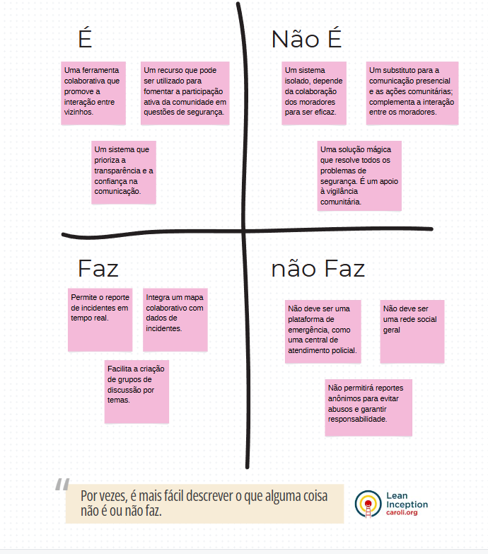
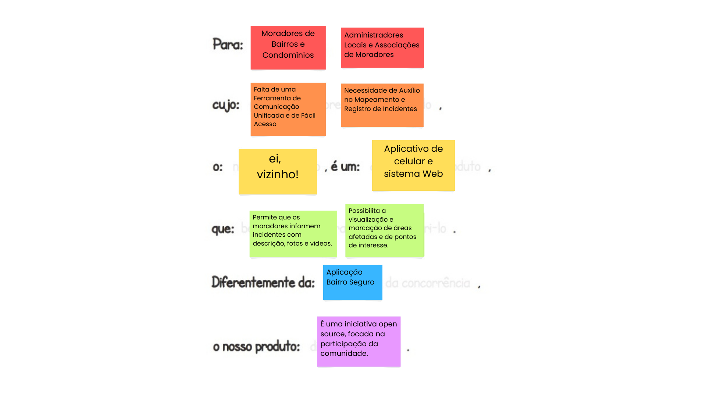

# Engenharia de Software III
*Projeto a ser desenvolvido de forma a integrar os conhecimentos das disciplinas de Programação para a Internet, Programação para Dispositivos Móveis e Engenharia de Software III.*

## Equipe
- _**Ruan Macedo**_
- _**Lívia Brito**_
- _**Bianca Bezerra**_
- _**Antonio Meireles**_

---

## Aplicativo de Vizinhança Segura
### Área/Tema Principal do Projeto:
- **Segurança e Comunicação Comunitária**

### Provável Sistema a Ser Desenvolvido:
- **Sistema de Comunicação e Relatos de Segurança entre Vizinhos**
- O sistema consiste em um aplicativo mobile e um painel web (para gerenciamento por administradores locais) que facilita a troca de informações sobre segurança entre moradores de um bairro ou condomínio.

### Problema Principal:
A falta de comunicação e cooperação entre vizinhos em relação a ocorrências de segurança nos bairros. Muitos incidentes poderiam ser prevenidos se a informação fosse rapidamente compartilhada entre os moradores.

### Funcionalidades Principais:
**Alerta de Incidentes**:
   - Permite que os usuários reportem, em tempo real, acontecimentos suspeitos ou emergenciais, como assaltos, movimentos estranhos ou acidentes.
   - Inclui a possibilidade de adicionar descrições, fotos e vídeos dos incidentes para fornecer mais detalhes.

 **Mapa Colaborativo**:
   - Um mapa interativo onde os usuários podem visualizar os locais dos incidentes reportados.
   - Marcações em diferentes cores para indicar o tipo de incidente (roubo, assalto, acidente, etc.).
   - As marcações podem ser visualizadas por período, como últimas 24 horas, 7 dias ou 30 dias, para ajudar a identificar padrões de risco.

**Grupos de Discussão**:
   - Possibilita a criação de grupos de bate-papo entre vizinhos, para discutir medidas de segurança, melhorias no bairro e troca de informações sobre atividades suspeitas.
   - Os grupos podem ser criados para temas específicos, como "Segurança", "Problemas com Iluminação Pública", ou até "Animais Perdidos", incentivando a cooperação comunitária.

## Artefatos
### [Documento de Brifieng](https://docs.google.com/document/d/1IpTX0NJsJn_rFgGqwtmgFq4kKc9_VCQZ/edit?usp=sharing&ouid=114902268998971999543&rtpof=true&sd=truel "Link para o documento") 
### [Documento de Pesquisa de Mercado](https://docs.google.com/document/d/1bnJU8JHj82Q5iY5SOf8aRg7am7fEpNvJT-gaNZQasM8/edit#heading=h.30j0zll "Link para o documento")
### Matriz É Não-É, Faz Não-Faz

### Visão de Produto

---

